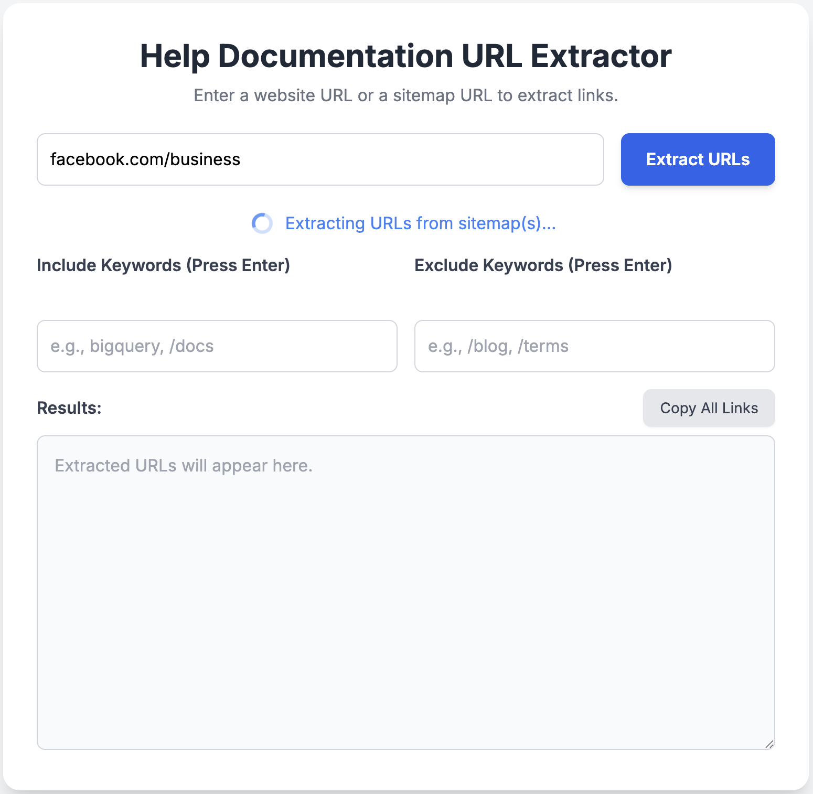
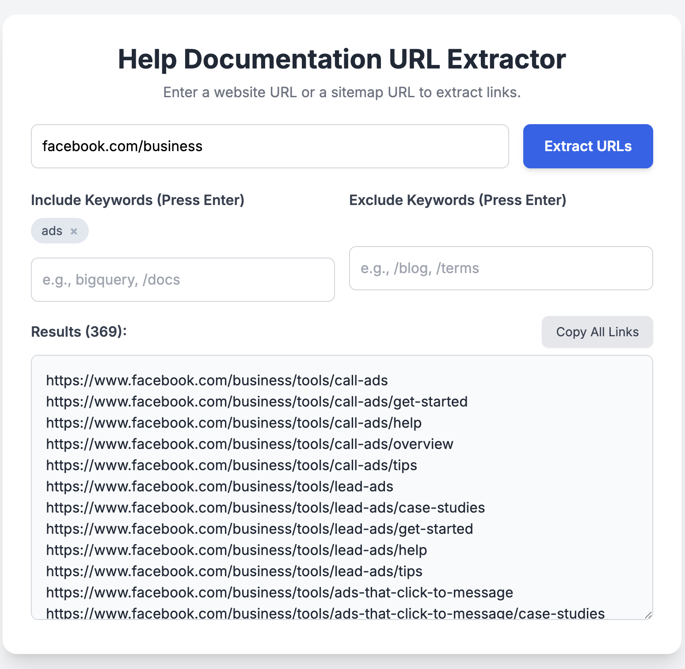

# Documentation Extractor

A Google Apps Script web app that extracts documentation URLs from any website's XML sitemaps — built for pasting directly into [NotebookLM](https://notebooklm.google.com/) and similar AI knowledge tools to create instant expert guides.

**[Live Demo](https://script.google.com/macros/s/AKfycbzgV2O-n-SXwf6UFRpaFecys6rdFitA4kZZEov9eMQKX4GHvlbkt9KCCbXsR0wgOdomLQ/exec)**

## Background

LLMs frequently hallucinate technical specifics—API parameters, CLI flags, and configuration schemas—because their training data is often outdated or generic. To get accurate answers, you need to ground the model in official, real-time documentation.

The friction point: Most documentation sites are massive. Manually hunting for relevant URLs to feed into an AI tool is tedious.

The solution: Documentation Extractor automates the discovery and filtering of a site's entire documentation architecture. By extracting every relevant URL from a sitemap, you can paste a clean list directly into NotebookLM, creating a "Second Brain" trained exclusively on official sources.

This workflow became the starting point for DocWeb, a more fully featured sitemap extraction and chatbot platform. (Currently in private beta)

## What It Does

- **Sitemap discovery** -- finds sitemaps via `robots.txt` or the common `/sitemap.xml` path
- **Recursive parsing** -- follows sitemap index files to extract nested sitemaps
- **Batch fetching** -- processes URLs in chunks of 50 with exponential-backoff retry
- **Keyword filtering** -- include/exclude filters with a tag-bubble UI so you can narrow down url paths in real time
- **One-click copy** -- copies the filtered URL list to your clipboard

## How It Works

The app has a two-phase flow:

1. **Find sitemaps** -- Enter a domain (e.g., `cloud.google.com`) or a direct sitemap URL. The backend checks `robots.txt` for `Sitemap:` directives, falling back to `/sitemap.xml`.
2. **Process sitemaps** -- Select one or more discovered sitemaps. The backend recursively fetches and parses every sitemap index and URL set, deduplicates the results, and returns them to the frontend where you can filter by keyword.

The backend (`Code.gs`) runs on Google Apps Script using `UrlFetchApp` and `XmlService`. The frontend (`Index.html`) is a single-page HTML/JS app served by `HtmlService`.

## Tech Stack

- Google Apps Script (server-side JavaScript)
- HTML5 / vanilla JavaScript
- Tailwind CSS (via CDN)
- XML sitemap parsing (`XmlService`)

## Setup

1. Go to [script.google.com](https://script.google.com) and create a new project.
2. Replace the default `Code.gs` with the contents of `Code.gs` from this repo.
3. Create a new HTML file named `Index.html` and paste the contents of `Index.html`.
4. Click **Deploy > New deployment**, choose **Web app**, and set access to your preference.
5. Open the deployment URL in your browser.

## Usage

1. Enter a website domain (e.g., `example.com`) or a direct sitemap URL.
2. Click **Extract URLs**. The tool searches for sitemaps at that domain.
3. If multiple sitemaps are found, select which ones to process or click **Process All**.
4. Once extraction completes, use the **Include Keywords** and **Exclude Keywords** fields to filter results (press Enter to add each keyword).
5. Click **Copy All Links** to copy the filtered URLs to your clipboard.

## License

[MIT](LICENSE)
